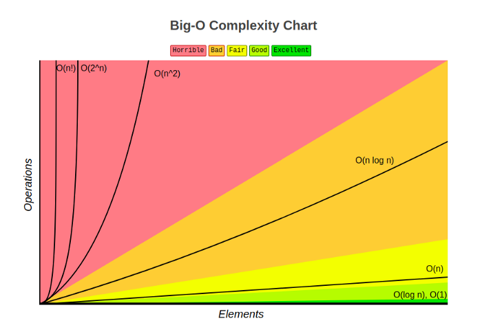

# Big O Notation
 * Big O notation is a mathematical notation that describes the limiting behavior of a function when the argument tends towards a particular value or infinity.
 * Big O is a member of a family of notations invented by Paul Bachmann,Edmund Landau, and others, collectively called Bachmann–Landau notation or asymptotic notation
 * In computer science, big O notation is used to classify algorithms according to how their run time or space requirements grow as the input size grows.
 * The letter O is used because the growth rate of a function is also referred to as the order of the function
 * Big O specifically looks at the worst-case scenario of an algorithm – looking at the big picture. It tells us how long a function will take to execute (execution time) or how much space (e.g., in memory or disk) the function takes up as the input to that function approaches infinity (i.e. becomes very large).

    

    *fig 1. Time complexities chart*

    
    
    *fig 2. Comparison of the complexities*

 * **Time complexity**: Analysing how the runtime of an algorithm changes as the input increases.
 * **Space complexity (aka auxiliary space complexity)**: The space required by the algorithm, not including inputs.
 

### Big O Complexities: 

1. **Constant Time - O(1)**: 
    * An algorithm is said to run in constant time if the execution time remains the same as the size of the input to the function increases. 
	* Run time is independent of the input size of the problem.
 
2. **Linear Time - O(n)**: 
	* An algorithm is said to run in linear time if the execution time of the function is directly proportional to the input size.
	* O(n) means that the growth rate is linear — as n increases, the processing time increases at the same rate.

3. **Logarithmic Time - O(log n)**: 
	* O(log n) algorithms never look at all the elements in the input. 
	* Logarithmic time complexities usually apply to algorithms that eliminate large amounts of input elements in each step.
	* The approach is called divide-and-conquer method. 
	* An example of an O(log n) algorithm would be a binary search algorithm.
	* Once a list is ordered, it can be searched using a divide-and-conquer strategy. 
	* Binary search algorithm finds the middle of the given element and it compares to the desired object. If the match is found, the search is successful and is terminated.
	* If it is not matched, It determines the middle element is greater than or less than the desired object. This will eliminate half of the list. 
	* It repeats the same procedure again and again until the desired object is found.
	* Usually more efficient and scalable than the linear time algorithm because it doesn't have to search through all the elements of the list.

		```
        let arrA = [1] // 0 loops 
        let arrB = [1, 2] // 1 loop
        let arrC = [1, 2, 3, 4] // 2 loops
        let arrD = [1, 2, 3, 4, 5, 6, 7, 8] // 3 loops
        let arrE = [1, 2, 3, 4, 5, 6, 7, 8, 9, 10, 11, 12, 13, 14, 15, 16] // 4 loops
        ```

	* As we can see from the examples (arrA, arrB, etc…), every time we double the length of the input array, the number of operations increases linearly (by 1 each time).
	* In simple terms, the number of operations doesn’t increase very much when we increase the size of the input.
	* For 1 million entries, Logarithmic growth will only do a maximum log<sub>2</sub>1000000 = 19 comparisons.

        

        *fig 3. Binary tree*

4. **Quadratic Time - O(n²)**: 
	* The quadratic algorithm is almost the reverse of the logarithmic algorithm. The number of steps required by the quadratic algorithms is the square root of input size. 
    * If the input size is 2, then the required steps are 4. If the input is size 8, it will take 64, and so on.
	* A good rule-of-thumb: If possible, avoid nested for-loops if the input size is large. Use n separate loops instead.

5. **Linearithmic Time - O(n log n)**: 
	* Linearithmic time is simply a combination of linear time O(n) and logarithmic time O(log n).
	* You can easily spot if an algorithm has n log(n) time. Look for an outer loop that iterates through a list (n operations). Then look to see if there is an inner loop; If the inner loop is cutting down/reducing the data set on each iteration (log(n) operations), then the overall algorithm has a Big O (n log(n)).
	* Linearithmic time is less efficient than linear time, O(n), but more performant than quadratic time, O(n^2). 
	* A common, practical example of a linearithmic time complexity algorithm is the sorting algorithm, Merge Sort - a divide and conquer style algorithm.

6. **Exponential Time - O(2^n)**: 
	* An algorithm with exponential time complexity is one where the number of operations doubles every time we increase the input by one.
	* If the input size is 1, then 2^1 = 2 operations. If the input size is 2, then 2^2 = 4 operations
	* For example: a Fibonacci number is the sum of its previous 2 neighbours.
	* The Fibonacci sequence is 1, 1, 2, 3, 5, 8, 13, 21, etc.

7. **Factorial time complexity - O(n!)**: 
	* A factorial is just the product of every number up to that number. 
	* So 5! = 1 x 2 x 3 x 4 x 5 = 120.
	* Factorial should be avoided at ALL costs, as it things can get out of hand very quickly.

        

        *fig 4. Factorial time illustration*


### Basic Rules:
 * Always assume worst-case scenario.
 * Drop the constant additions: n + 5 is O(n)
 * Drop the constant multiples. 0.5n + 2n + 7 is O(n).
 * Doing a constant operation 2n times is O(n).
 * Doing O(n) operation n/2 times is O(n²).
